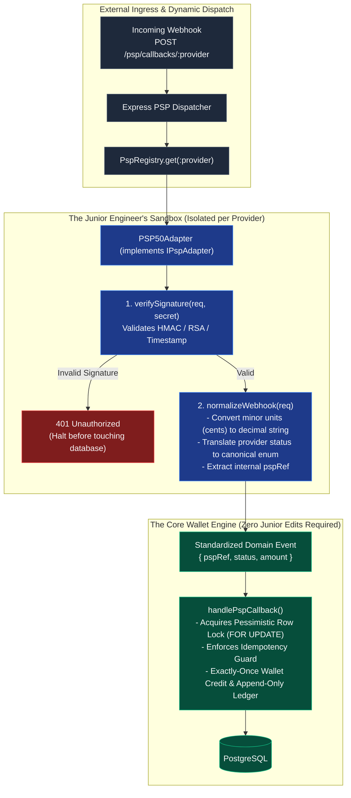

# Part B: Architecture Design Note — Onboarding the 50th PSP in Under 1 Day

> **Target**: How to onboard the 50th PSP safely in under 1 day by a junior engineer  
> **Author**: Kristian Indra (Backend Lead Take-Home)  
> **Perspective**: Developer Experience, Safety Guardrails & Real-World Operations

---

## 1. The Human Problem: Why Onboarding PSPs Usually Terrifies Junior Engineers

When a junior engineer joins a fintech or gaming company and is asked to "integrate our 50th payment provider," their biggest fear is breaking something critical. They're handling real money, and they worry:
- *"What if I calculate the balance wrong?"*
- *"What if I introduce a race condition during a webhook retry?"*
- *"What if this provider sends amounts in cents instead of dollars and I credit 100x too much?"*

As an engineering lead, my philosophy is simple: **junior engineers should never be placed in a position where a simple mistake can corrupt the core ledger.**

If a junior engineer needs to touch SQL queries, understand database row locks (`SELECT ... FOR UPDATE`), or manually update wallet balances to add a payment provider, the architecture has failed them.

The solution is an **isolated, contract-driven adapter architecture**. The junior engineer only writes translation code at the edge. The core transaction engine remains completely untouchable.

---

## 2. The Architecture: Gateway & Adapter Boundary



---

## 3. The Contract: `IPspAdapter`

Every payment provider is wrapped in an adapter implementing a strict, self-documenting TypeScript interface:

```typescript
export interface NormalizedWebhookResult {
  pspRef: string;                          // Our internal reference (e.g. psp_dep_uuid)
  status: 'completed' | 'failed' | 'ignored'; // 'ignored' for non-financial webhooks (e.g. KYC, disputes)
  amount: string;                          // Normalized decimal string (e.g. "100.50")
  providerRef: string;                     // Provider's external transaction ID (for audit trails)
  failureReason?: string;
  rawPayload: Record<string, unknown>;     // Stored in ledger metadata for forensics
}

export interface IPspAdapter {
  readonly providerId: string;

  /**
   * 1. Cryptographic Verification: Validates webhook authenticity.
   * Crucial detail: Accepts unparsed rawBuffer to prevent JSON whitespace alterations from breaking HMACs.
   */
  verifySignature(headers: Record<string, string>, rawBody: Buffer, secret: string): Promise<boolean>;

  /**
   * 2. Semantic Normalization: Translates provider-specific quirks into clean domain concepts.
   */
  normalizeWebhook(req: { headers: Record<string, string>; body: any }): Promise<NormalizedWebhookResult>;

  /**
   * 3. Initiation: Generates payment intent / redirect URLs for deposits.
   */
  initiateDeposit(params: { pspRef: string; amount: string; memberId: string }): Promise<{ redirectUrl?: string; clientSecret?: string }>;
}
```

---

## 4. Configuration-Driven Registry (Zero Route Changes)

Instead of maintaining a massive `switch/case` statement or dozens of Express route files, all routing is handled dynamically by a central registry:

```typescript
// src/psp/registry.ts
export class PspRegistry {
  private static adapters = new Map<string, IPspAdapter>();

  public static register(adapter: IPspAdapter): void {
    this.adapters.set(adapter.providerId.toLowerCase(), adapter);
  }

  public static get(providerId: string): IPspAdapter {
    const adapter = this.adapters.get(providerId.toLowerCase());
    if (!adapter) throw new NotFoundError(`Payment provider '${providerId}' is not configured`);
    return adapter;
  }
}
```

When adding PSP #50, configuration lives in a standard JSON or environment config file:
```json
{
  "psp50": {
    "enabled": true,
    "webhookSecret": "env:PSP50_WEBHOOK_SECRET",
    "apiKey": "env:PSP50_API_KEY",
    "currencyMinorUnitExponent": 2
  }
}
```

---

## 5. The Junior Engineer's 1-Day Playbook

Here is the exact day-in-the-life workflow for the junior engineer shipping PSP #50:

1. **Morning (Scaffold & Code)**:
   - Run our generator: `npm run generate:psp --name=psp50`.
   - This creates a template `src/psp/adapters/psp50/psp50Adapter.ts` and test fixture folders.
   - The junior implements `verifySignature` (using the provider's docs) and `normalizeWebhook` (mapping their status strings like `"PAID"` or `"SETTLED"` to `'completed'`).
2. **Afternoon (Add Contract Fixtures)**:
   - Paste 3–4 raw JSON payloads from the provider's documentation or sandbox into `test/fixtures/psp50/` (`success.json`, `declined.json`, `minor_units.json`).
   - Run the contract test suite: `npm test test/psp/psp50.test.ts`.
3. **End of Day (Deploy)**:
   - Register the adapter in `src/psp/index.ts`.
   - Submit the PR. Since zero lines of core database or wallet code were touched, the senior review takes 10 minutes, focusing only on the provider mapping.

---

## 6. Testing Strategy: Zero Live Network Calls in CI

### Why Live Sandbox Calls in CI are a Trap
Calling third-party sandbox APIs during CI is a recipe for broken builds and developer frustration:
- PSP sandboxes go down frequently on weekends and evenings.
- Sandbox rate-limits cause random test flakiness.
- Network latency turns a 30-second CI run into a 5-minute crawl.

### The Three-Tier Offline Testing Strategy

#### Tier 1: Golden Master Fixture Tests
We test the adapter entirely offline using captured, real-world webhook payloads:
```typescript
describe('PSP50 Webhook Normalization', () => {
  const adapter = new Psp50Adapter(config);

  test('normalizes cent-based amounts correctly', async () => {
    const fixture = require('../fixtures/psp50/success_cents.json');
    const result = await adapter.normalizeWebhook(fixture);
    expect(result.amount).toBe('100.50'); // 10050 cents -> "100.50"
    expect(result.status).toBe('completed');
  });
});
```

#### Tier 2: Cryptographic Tampering & Replay Tests
We verify security rules with unit tests:
- Tampering with even 1 byte in the webhook payload fails verification.
- Replaying a valid webhook with a timestamp older than 5 minutes is rejected.
- Invalid secret keys immediately reject.

#### Tier 3: Local Webhook Replay CLI
Before opening a PR, the junior engineer can run our local CLI replay tool:
```bash
npm run psp:replay -- --provider=psp50 --fixture=success.json
```
This sends an actual local HTTP POST to their running server (`http://localhost:3000/psp/callbacks/psp50`) with an auto-generated HMAC signature, confirming that their adapter seamlessly hands off the normalized event to `PspCallbackService` and updates the database.
