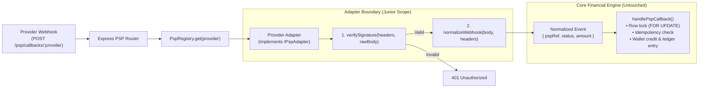

# Part B: Integrating the 50th PSP

**Candidate**: Kristian Indra  
**Role**: Backend Lead  
**Prompt**: How to structure this codebase so integrating a new PSP is a one-day task safely done by a junior engineer.

---

## 1. Core Principle: Edge Isolation

To make onboarding safe and rapid for a junior engineer, **the core financial engine must be completely off-limits**. A junior engineer should never write raw SQL, manage database row locks (`FOR UPDATE`), or touch wallet balance calculations to add a payment provider.

All provider-specific code lives exclusively in an **isolated adapter layer at the system boundary**. The adapter verifies and normalizes provider data into a canonical domain event. Once normalized, the event passes into the existing, battle-tested `handlePspCallback` service which enforces locking, idempotency, and ledger writes.

---

## 2. Architecture & Data Flow



---

## 3. The Adapter Abstraction (`IPspAdapter`)

Every provider implements a unified TypeScript contract:

```typescript
export interface NormalizedWebhook {
  pspRef: string;                          // Internal reference (e.g. psp_dep_uuid)
  status: 'completed' | 'failed' | 'ignored'; // 'ignored' for non-financial events (e.g. disputes, KYC)
  amount: string;                          // Normalized decimal string (e.g. "100.50")
  providerRef: string;                     // External transaction ID for audit tracking
  failureReason?: string;
  rawPayload: Record<string, unknown>;     // Stored in ledger metadata for auditing
}

export interface IPspAdapter {
  readonly providerId: string;

  /**
   * Cryptographic verification using provider raw payload and secret.
   * Uses unparsed Buffer to prevent whitespace/serialization issues with HMACs.
   */
  verifySignature(headers: Record<string, string>, rawBody: Buffer, secret: string): Promise<boolean>;

  /**
   * Normalizes provider quirks: converts minor units (cents to decimal),
   * maps provider status codes ("PAID", "SETTLED") to canonical enum.
   */
  normalizeWebhook(req: { headers: Record<string, string>; body: any }): Promise<NormalizedWebhook>;
}
```

### Where Verification & Normalization Live
- **Verification**: Executes before JSON parsing (on raw body buffers) to prevent signature invalidation caused by JSON key reordering or whitespace normalization. Invalid signatures return `401 Unauthorized` without querying the database.
- **Normalization**: Translates provider dialects (e.g. minor units like cents, timestamps, status vocabulary) into standard decimal strings and canonical statuses (`completed` | `failed`).

---

## 4. Configuration-Driven Registry

A generic router routes webhooks dynamically without modifying Express route files:

```typescript
// Router handles: POST /psp/callbacks/:provider
export async function pspWebhookHandler(req: Request, res: Response, next: NextFunction) {
  const adapter = PspRegistry.get(req.params.provider);
  const config = PspConfig.get(req.params.provider);

  const isValid = await adapter.verifySignature(req.headers as any, req.rawBody, config.webhookSecret);
  if (!isValid) return res.status(401).json({ error: 'invalid_signature' });

  const normalized = await adapter.normalizeWebhook(req);
  if (normalized.status === 'ignored') return res.status(200).json({ status: 'ignored' });

  const result = await handlePspCallback({
    pspRef: normalized.pspRef,
    status: normalized.status,
    amount: normalized.amount,
  });

  return res.status(200).json(result);
}
```

Adding a provider requires only:
1. Creating the adapter class in `src/psp/adapters/<provider>.ts`.
2. Adding credentials to configuration:
```json
{
  "stripe": {
    "enabled": true,
    "webhookSecret": "env:STRIPE_WEBHOOK_SECRET",
    "minorUnitExponent": 2
  }
}
```

---

## 5. Offline Testing Strategy (No External Sandbox in CI)

Third-party sandboxes are notoriously flaky, rate-limited, and slow for CI pipelines. The integration is tested entirely offline:

1. **Golden Master Fixture Tests**:
   The junior engineer captures 3–4 raw webhook payloads (`success.json`, `declined.json`, `minor_units.json`) from the provider's docs or local sandbox into `test/fixtures/<provider>/`. Unit tests verify that `normalizeWebhook` produces the expected canonical event.
2. **Signature & Tampering Tests**:
   Verify that valid HMACs pass, while altered payload bytes, missing headers, or timestamps outside the tolerance window (e.g. >5 minutes old) are rejected with `401`.
3. **Local Replay CLI**:
   A lightweight CLI tool (`npm run psp:replay -- --provider=<name> --fixture=success.json`) sends real HTTP requests with generated signatures to the local dev server, allowing the engineer to verify end-to-end processing against PostgreSQL before opening a PR.
